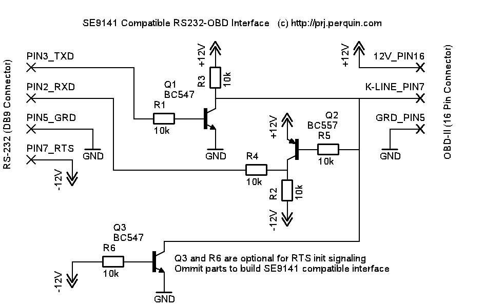
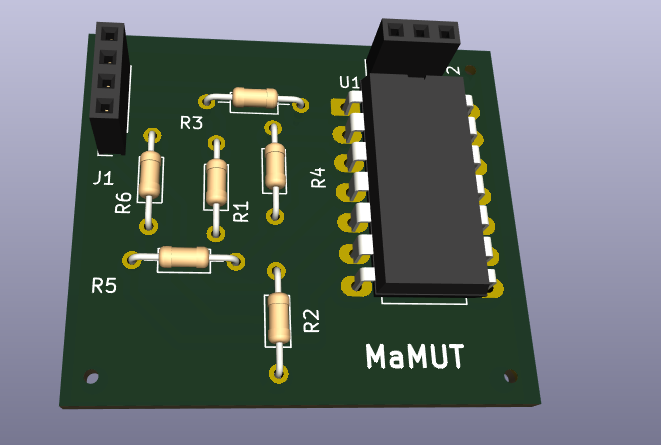

# MUT 3S BOX

#### (Elija su idioma abajo / Choose your language below)

# Inspiración
Los 3000GT / Stealth 91-95 no tienen soporte con lectores OBD comerciales o fáciles de conseguir ya que usan un protocolo simple con inicialización específica.

Existen proyectos viejos que soportaban la plataforma como:
- MMCDLogger en Palm (91-93):  https://mmcdlogger.sourceforge.net/
- Mitsulogger (94-95+): https://github.com/dparrish/ecurom/tree/master/tools/MitsuLogger

Y algunos cables/loggers comerciales como:
HHH, EvoScan, pocket logger.

Las opciones gratuitas consistían en:
- 1G: Descargar MMCDLogger y un emulador de Palm, armar un cable DSM (el diagrama de https://www.dsmtuners.com/threads/how-to-set-up-mmcd-make-a-logging-cable.203316/) y conseguir un adaptador RS232.

- 2G: Descargar Mitsulogger, construir un circuito adaptador de voltaje "K-Line" y usar un adaptador FTDI (El primero que usé y armé fue de: https://www.3si.org/threads/anyone-up-for-a-7-hybrid-logging-cable.436691).

Después encontré esto:
https://github.com/muki01/OBD2_K-line_Reader/

El lector K-line se me hizo conocido y ya había usado algo similar para leer códigos con arduino en los 1G, el protocolo es el más simple y ya conocía los comandos de mmcdlogger/Evoscan/Mitsulogger.

Pero, tener un servidor completo y una interfaz gráfica desde el ESP32 me pareció genial y empecé a construir el proyecto, funciona muy bien y está enfocado a ser más universal OBD2.

Así que empecé a adaptar esto para los 91-95 que NO son OBD2 y no soportan las características del estándar.

## Vehículos soportados
- Mitsubishi MUT / MUT Híbridos
- 91-93 mensaje simple de petición-respuesta / 94-95con inicialización de 5 baud.

Los 96+ son OBD2 y están soportados por los OBD2 comerciales que existen (elm327, etc.) así que no son el enfoque de este proyecto.

## Hardware requerido
- PCB con circuito "K-Line"  (3 opciones, chequen: https://github.com/muki01/OBD2_K-line_Reader), usé la del comparador.

- ESP32 (Usé un ESP32 Wroom 32 DevKit / Doit ESP32 Devkit v1)

⚠️ Advertencia para los ESP32-WROOM-32D / 32U
Si el ESP32 que conseguiste es el ESP32-WROOM-32D o ESP32-WROOM-32U (las versiones más comunes), los GPIO 16 y 17 no servirán para esto (RX/TX).

Pines de uso general alternativos:
• GPIO 18, 19, 21, 22, 23, 25, 26, 27, 32, 33

## Librerías requeridas
- ESPAsyncWebServer: https://github.com/ESP32Async/ESPAsyncWebServer (por lo menos 3.6.2)
- AsyncTCP: https://github.com/ESP32Async/AsyncTCP (por lo menos 3.3.2)
- ArduinoJson

## ☕ Cómprame un café

Si la información fue útil, te ayudó o sirvió:

  

